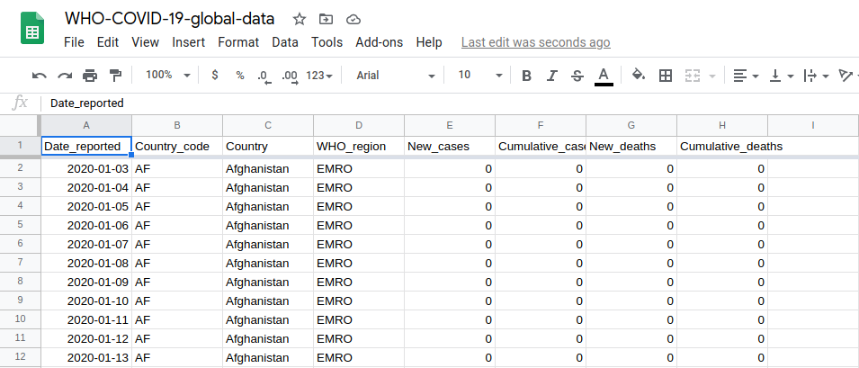
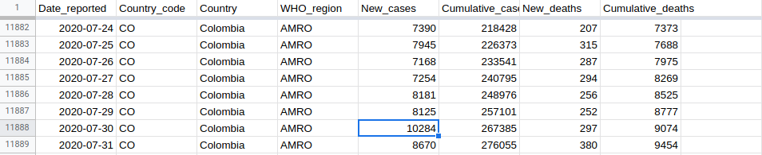
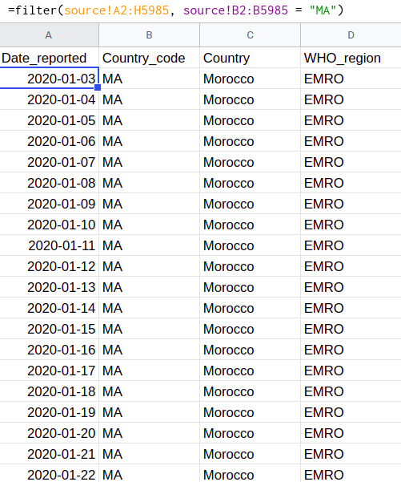
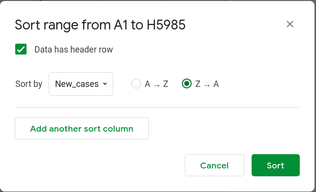
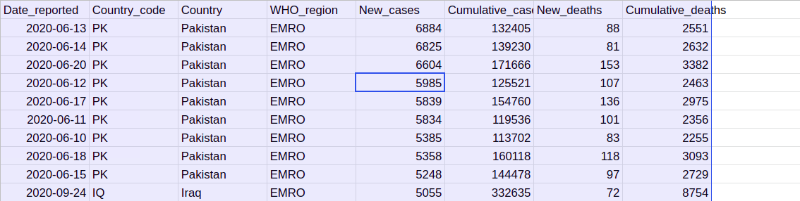
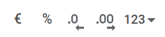
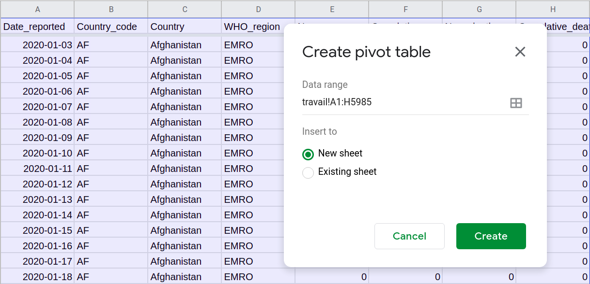
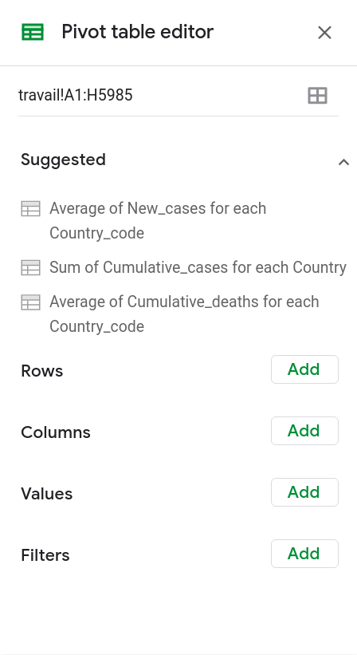

layout: true
  

`r paste0("<div class='my-footer'><span>", params$event, "</span> <center><div class=logo></center></span></div>")` 


---

background-image: url("https://media.giphy.com/media/AXorq76Tg3Vte/giphy.gif")
class: center, top, inverse

# Analyser les données


---

background-image: url("https://media.giphy.com/media/3o7aTFnG95Q8VIsRqw/giphy.gif")
class: center, top, inverse


## 1. Traduire une question journalistique en traitement de données


---

### Savoir lire un tableau

Nous envisagerons le travail d'analyse de données comme un travail de traduction. Comme toute traduction, il consiste en deux exercices :
* **le thème** : traduire une problématique journalistique en opération informatique ;
* **la version** : traduire un résultat informatique en considération journalistique.

Pour s'adonner à la version, il est important d'adopter une base commune. Nous utiliserons pour cela le vocabulaire descriptif de la data science, évoqué dans le webinaire 3.

--

Au delà du traitement des données, la démarche de traduction est un exercice qui vous permettra de communiquer le résultat de vos analyses à votre lectorat, **c'est-à-dire pouvoir expliquer ce que contient une base de données et qu'elle le comprenne sans avoir la base de données sous les yeux**.

---

class: top, inverse

#### Exemple : le Coronavirus Dashboard de l'OMS



Le coronavirus dashboard de l'OMS peut être récupéré au format CSV sur la page dédié : https://covid19.who.int/table. Pour simplifier les manipulations, nous vous proposons une version allégée [sur le Github de la formation](https://github.com/datactivist/dwa_ddj_maroc/blob/master/data/oms_covid_emro.csv) avec seulement les pays de la zone "Méditerranée orientale" (EMRO).

---

### Identifier les dimensions

Lire un tableau, c'est d'abord comprendre le sens de ses dimensions :
1. comment et pourquoi a été construite **la base de données** ?
2. que décrivent **les variables** ?
3. à quoi se réfèrent **les observations** ?
4. à quoi correspondent **les valeurs** ?

--

Reprenons la BDD OMS Covid-19. Pouvez-vous déterminer le sens de ses dimensions :
* base de données ?
* variables ?
* observations ?
* valeurs ?

---

### Lire un tableau en français courant

Un exercice pratique consiste à essayer de lire un tableau *en français courant*. C'est-à-dire de faire une phrase décrivant l'information délivrée par une cellule donnée de la base de données.

Par exemple, ici : quelle information nous donne cette cellule ?



--

> Le 30 juillet 2020, 10284 nouveaux cas de Covid-19 ont été déclarés en Colombie.

Notez que chaque terme se réfère précisément au sens des variables, y compris le verbe. **Vérifier sa compréhension d'une base de données en français courant permet de s'entraîner à traduire journalistiquement les informations délivrées par une base de données.**

---

### Déterminer les limites des données

.pull-left[Avant tout analyse, il est essentiel de déterminer ce qu'un tableau contient et ce qu'il ne contient pas. Autrement dit, **ses limites**.

Ce préalable est essentiel car il permet de se poser les questions *depuis l'intérieur du tableau* et non pas en fonction de ce qu'on espère y trouver.

Quelles informations trouvez-vous dans ce tableau ?
Quelles informations aimeriez-vous trouver qui n'y sont pas ?
]

--

.pull-right[Les points clefs à retenir :
* il s'agit de **déclaration** par les autorités sanitaires ;
* **nous ne disposons pas de la date de contamination** ;
* **nous ne disposons pas des modalités de transmissions** ;
* **nous ne disposons pas des modalités de dépistage** ;
* etc.]

---

### Traduire ses questions journalistiques en opérations

Une fois déterminées les limites d'une base de données et la signification de ses dimensions, nous pouvons nous poser des questions *depuis l'intérieur de la base*, sans risquer d'extrapoler ou de mal interpréter.

Pour cela, quelques points de méthode sont nécessaires :
* **les questions se réfèrent à des dimensions existantes de la base de données**. Ici, par exemple, nous ne pouvons pas savoir *"qui ?"* ou *"où ?"*, seulement *"dans quel pays ?"* ;
* **les questions s'inscrivent dans les limites de la base de données**. Dans notre cas, nous ne disposons pas des données avant janvier 2020, ni des données à l'échelle des régions ou des villes, seulement des pays ;
* **les questions appellent des réponses précises et reposent donc sur des critères précis**. *"Quels sont les trois pays ayant connu la plus grosse augmentation du nombre de cas en valeur absolue en avril ?"* est une question précise alors que *"Quels sont les pays qui ont eu beaucoup de morts du Covid au début de l'épidémie ?"* est très vague.

---

### Exemple de traduction

Prenons un exemple concret de question sur la base de données :

> *Quels sont les trois pays ayant connu la plus grosse augmentation du nombre de cas en valeur absolue en avril ?*

Des termes clefs nous permettent d'identifier les dimensions sur lesquelles vont porter notre analyse et les manipulations et opérations à réaliser :
1. *"trois pays"* : nous ne retiendrons donc que 3 observations ;
2. *"la plus grosse augmentation"* : il nous faudra  trier par ordre croissant ;
3. *"nombre de cas en valeur absolue"* : nous devrons faire une somme des valeurs de la variable "nouveaux cas" ;
4. *"en avril"* : il nous faudra nous concentrer sur le mois d'avril dans la variable de dates.

--

Il ne nous reste plus qu'à identifier les outils et à les assembler pour pouvoir répondre à cette question.

---


background-image: url("https://media.giphy.com/media/3orieQihlYE7eAmDQY/giphy.gif")
class: center, top, inverse


### Notre horizon : la carte aux trésors !


---

background-image: url("https://media.giphy.com/media/xT0xekLZmeC54FCTJu/giphy.gif")
class: center, top, inverse


## 2. Les outils de traitement (et à quoi ils servent)

---

class: top, inverse

### Manipulations

Le premier type d'outils utilisé seront des outils de manipulation. C'est-à-dire des outils par lesquels nous allons modifier **l'apparence** des données mais pas leur nature.

Il s'agira donc de créer des **vues**, autrement dit des mises en forme visuelle par lesquelles nous serons à même de saisir des informations plus précises sur les données disponibles.

---

#### Les filtres (pour se concentrer)

Nous avons déjà vu dans le webinaire 3 comment filtrer une colonne. Il est également possible de filter avec la fonction `filter()`. Pour cela il faut renseigner au moins deux arguments :
* le **champs de données** (les données à filtrer) ;
* au moins une **condition** pour les trier.

Par exemple, pour ne garder que les données concernant le Maroc :
```
* =filter(source!A2:H5985 ; source!B2:B5985 = "MA")
```


.pull-left[**Traduction**
* *source!A2:H5985* signifie : les données de la feuille *source* de A2 à H5985 ;
* *source!B2:B5985 = "MA"* signifie : uniquement les observations où B prend la valeur *"MA"* (correspondant au Maroc).
]

.pull-right[**Résultat**



]

---

#### Le tri (pour ordonner)

Une autre manipulation courante consiste à trier les données. Un tri peut avoir deux "sens" :
* **croissant** : de A à Z ou de 0 à l'infini, selon qu'on traite des chaînes de caractères ou des valeurs numériques ;
* **décroissant** : de Z à A ou de l'infini à zéro.

Un tri peut par ailleurs porter sur une ou plusieurs variables. Dans ce cas, le paramétrage du tri doit spécifier **l'ordre de tri**. Pour trier, sélectionnez le champs de données à trier puis allez dans *Données / Trier le champs* ou *Data / Sort range* :

.pull-left[**Traduction**

Trier la colonne *"Nouveau cas"* par ordre décroissant de valeur.

]

.pull-right[**Résulat**

Le tableau propose les jours où les pays ont déclaré le plus de nouveaux cas dans la région par ordre décroissant :

]

---

class: top, inverse

### Opérations

Nous parlerons d'**opérations** quand, sur la base des données disponibles, nous produisons d'autres données utiles à notre analyse.

Nous parlons d'opérations car elle consistent le plus souvent en des opérations mathématiques permettant de synthétiser une base de données de manière globale ou par groupe.

Si elles peuvent être utilisées de manière globale, les opérations constituent un puissant outil quand elles sont mobilisées pour créer des nouvelles variables permettant d'approfondir la base et d'élargir le spectre de l'analyse.

---

#### Les comptes (pour énumérer) - 1

Google Sheets propose de nombreuses fonctions permettant de réaliser des comptes suivant différents critères. Le principe en est toujours le même : renvoyer le nombre d'élément d'un certain type dans le champs de données spécifié en argument :
* =count() : énumère les valeurs numériques ;
* =counta() : énumère les valeurs alphanumériques ;
* =countunique() : énumère les valeurs uniques.

Le **champs de données** est toujours noté de la même manière : quand il est dans la même feuille que le calcul, on le note en donnant les coordonnées du point de départ séparées par les coordoonnées du point d'arrivée par deux points.

Sur la base du même champs de données (par exemple A1:B5), ces trois fonctions de comptage renverront trois résultats différents :
```
* =count(A1:B5)
* =counta(A1:B5)
* =countunique(A1:B5)
```

---

#### Les comptes (pour énumérer) - 2

Il est également possible de réaliser des **comptes conditionnelles**, c'est-à-dire de n'énumérer que les valeurs qui répondent positivement à un tesT. Cela permet, par exemple, d'avoir une idée rapide des valeurs non nulles dans un tableau ou de ne compter que les observations pour une valeur donnée.

Par exemple, si nous revenons à notre feuille où nous avons filtré uniquement les données concernant le Maroc :

```
*=countif(G:G ; ">0")
```

Se traduira par :

> *Dans la colonne G, combien d'observations présentent une valeur numérique supérieure à 0 ?*

Quelle est la réponse ? Comment la traduire en français courant ?

--

> *Entre le 3 janvier et le 30 septembre, il y a 165 jours où le Maroc a déclaré au moins un nouveau décès lié à la Covid.*

Oui mais, 165 jours sur combien ? Nous verrons plus tard comment le calculer ...

---

#### Les opérations arithmétiques (pour calculer)

Les feuilles de calcul (ou spreadsheet) permettent d'utiliser toutes les opérations aritmétiques classiques :
* addition ;
* soustraction ;
* division ;
* multiplication.

Elles intègrent également les règles d'**[ordre dans les opérations](https://fr.wikipedia.org/wiki/Ordre_des_op%C3%A9rations#:~:text=Les%20r%C3%A8gles%20de%20priorit%C3%A9%20sont,les%20calculs%20situ%C3%A9s%20en%20dehors.&text=dans%20les%20parenth%C3%A8ses%2C%20on%20effectue,ensuite%20pour%20additions%20et%20soustractions.)** : d'abord les parenthèses, puis les exponentielles, puis les multiplications/divisions, puis addition/soustraction ... le tout de gauche à droite. 

Les opérations plus complexes (exponentielles, racines, cosinus, etc.) sont accessibles via des fonctions spécifiques que vous pouvez retrouver dans le menu des fonctions, qui se déroule en cliquant sur la flèche à droite de l'icône correspondante.

---

#### Les moyennes (pour globaliser)

Pourriez-vous définir ce qu'est une moyenne ?

--

.pull-left[
La définition classique d'une moyenne est le résultat de la divison de la somme des nombres d'un ensemble de parties par le nombre de parties. De ce fait, la moyenne a tendance à *globaliser* un constat en supposant une répartition homogène d'un phénomène.

La fonction `average()` ne prend qu'un seul paramètre : le champs de données.

**Attention** : le salaire moyen cache souvent les déséquilibres au sein d'une population.

Cf. cet article sur les chiffres du CNSS [[source](https://www.moroccoworldnews.com/2019/07/278657/cnss-report-moroccan-workers-minimum-wage/)].
]

.pull-right[


]


---

#### La médiane et les quantiles (pour situer)

La **médiane** se concentre sur la **distribution**. C'est-à-dire la façon dont les individus se répartissent dans une population. Le salaire médian, par exemple, coupe la population en deux : *la moitié de la population gagne plus, la moitié de la population gagne moins*.

On peut diviser un ensemble en autant de fractions qu'on veut : en quart (quartiles), dixième (déciles), centièmes (centiles), etc. **La distribution est un outil d'analyse clef car il permet de caractériser la position des éléments par rapport à un ensemble et non l'invers**.


.pull-left[**Formules**

Reprenons notre BDD sur le Maroc :

```
*=average(E:E)

*=median(E:E)
```

Comment traduire les résultats ? Quels sont les résultats ?
]

--

.pull-right[**Traduction**

*Entre le 3 janvier et le 30 septembre 2020, le Maroc a déclaré en moyenne 446 nouveaux cas par jour.*

*Entre le 3 janvier et le 30 septembre 2020, la médiane du nombre de cas déclaré de la Covid au Maroc se situe à 102.*
]


---

#### Les conditions (pour tester)

Les **tests** sont un des outils de base de l'informatique : ON/OFF, TRUE/FALSE, ALLUME/ETEINT.

Dans un tableau, un test permet de vérifier une condition (comme pour *countif()*) et de paramétrer le comportement de la feuille de calcul suivant si elle est remplie ou non. On utilise pour cela la fonction **if()** avec les paramètres suivant :
* test ;
* résultat si vrai ;
* résultat si faux.

Pour reprendre notre tableau, on peut ainsi imaginer identifier les jours de "pics" de mortalité en fixant ce seuil à une valeur donnée. Si ce seuil est de 10, on pourra par exemple écrire :

```
*=if(G2 > 10, "pic", "normal")
```

---

class: top, inverse


### Mise en pratique

Dans la base de données de pays de la zone EMRO, vous réaliserez les opérations permetttant de répondre à ces questions :
1. Quel est le nombre moyen de nouveaux cas déclarés par jour sur la période, tous pays confondus ?
2. Quel est la somme des morts de la Covid enregistrés sur la période par le Yémen, les Emirats arabes unis et l'Arabie saoudite ?
3. Combien de fois un pays de la zone a déclaré un nombre de nouveaux morts négatif ?
4. Quel est le nombre moyen de cas cumulés sur la zone à la fin de la période (30 septembre 2020) ?
5. Quels sont les trois pays qui ont enregistré le plus grand nombre de cas en une seule journée sur la zone sur la période ?

--

*Pour répondre à cette question bonus, il nous faudra mobiliser de nouveaux outils. Gardez-la en mémoire :*

>Quel est le classement des cinq pays ayant déclaré le plus grand nombre de nouveaux cas au mois d'avril dans la zone ?

---


background-image: url("https://media.giphy.com/media/xUySTOigOUHucl3rfW/giphy.gif")
class: center, top, inverse


## 3. Méthodes d'analyse

---

### Combiner des fonctions

.pull-left[
Il peut être nécessaire pour certains calculs de combiner plusieurs fonctions afin d'arriver au résultat escompter. S'il est possible de faire des calculs intermédiaires, il est souvent plus simple et efficace d'emboîter les fonctions les unes dans les autres afin de réaliser tous les calculs d'un coup.

Il suffit pour cela d'**utiliser les fonctions comme des arguments** en les positionnant à l'endroit où ils sont attendus.]

.pull-right[.red[Par exemple]

si nous voulons savoir si le nombre de morts déclaré est au dessus ou en dessous de la moyenne, nous pourrions calculer la moyenne et *appeler* la cellule contenant la valeur.

Mais nous pouvons également réaliser un **test** sur la base de la **moyenne** calculée de cette valeur.

Pour ceci, il nous suffira d'arranger les arguments dans l'ordre demandé par la foncton. Comment pourrions-nous écrire cette fonction ?
]
--

```
*=if(G2 > average(G:G), "au dessus de la moyenne", "en dessous de la moyenne")
```

---

### Incrémenter des fonctions

.pull-left[
Utiliser une fonction sur une seule cellule n'a pas grand intérêt : pour créer une synthèse par colonne ou bien une nouvelle variable, il est essentiel de pouvoir *dérouler* une fonction.

Dans un tableur, nous parlons d'**incrémentation** : en "*tirant*" le bouton en bas à gauche d'une cellule d'une colonne vers la droite, toutes les coordonnées sont augmentées d'une colonne alors qu'en le "*tirant*" vers le bas, toute coordonnée se voit augmentée d'une ligne.
]

.pull-right[
Il est parfois nécessaire de *geler* un élément des coordonneés. Par exemple, si on veut diviser le nombre de mort pour une journée par le nombre total de mort, nous pourrons utiliser une fonction unique et la dérouler ... mais les coordonnées du total sont fixes et elles seront aussi incrémentées !

Pour éviter de le faire, il faut ajouter le signe **$** devant l'élément que l'on souhaite *geler* : soit la lettre de la colonne, soit le chiffre de la ligne, soit les deux.
]

--

En sachant ça, quelle sera la formule pour calculer le ratio du nombre de mort de chaque jour sur le nombre total de mort (situé en cellule H2152) ?

---

.pull-left[

#### Calculer un ratio / un pourcentage

Un **ratio** est le rapport entre une partie et son ensemble. Schématiquement :

```
*= partie / ensemble
```

Ce calcul produisant une fraction, peu lisible, on préférera souvent l'exprimer en **pourcentage**. Le calcul d'un pourcentage n'est qu'un effet d'unité : au lieu de considérer que l'ensemble vaut 1, on considère qu'il vaut 100.

Pour faire apparaître le pourcentage, il suffit de **changer l'unité** en cliquant sur le pourcentage dans la barre d'outils :


]

--

.pull-right[
#### Calculer une évolution

Pour calculer une évolution, il faut réaliser deux opérations :
* calculer la différence entre deux moments ;
* la rapporter au point de départ.

On peut ainsi schématiser le calcul d'évolution de la manière suivante :

```
*= (arrivée - départ) / départ
```

Il est possible d'adopter plusieurs échelles : évolution rapportée au jour, à toute la période, à une partie de la période ... il est essentiel de spécifier le choix que vous ferez dans le nom de la variable ainsi produite.
]
---

background-image: url("https://media.giphy.com/media/4tnvrl1BQkQa4/giphy.gif")
class: center, top, inverse


## 4. Le tableau croisé dynamique


---

#### Créer un tableau croisé dynamique

Le **tableau croisé dynamique** est un outil de manipulation de données qui permet de réaliser rapidement une feuille d'analyse en paramétrant les modalités de calcul utiles.

Pour **créer un tableau croisé dynamique** sous Google Sheets :
1. sélectionnez le champs de données que vous voulez étudier ;
2. cliquez sur *"Data/Pivot Table"* ou *"Données/Tableau croisé dynamique"* ;
3. choisissez le lieu où le créer ;
4. et c'est tout !



---

#### Paramétrer un tableau croisé dynamique

.pull-left[

]

.pull-right[Le paramétrage du tableau croisé dynamique passe par **l'interface d'édition**. Celle-ci fonctionne selon quelques principes simples :
* les manipulations reposent sur le traitement des variables ;
* trois dimensions peuvent être configurées : les lignes, les colonnes et les valeurs ;
* lignes et colonnes peuvent être triées selon des critères paramétrables ;
* les valeurs peuvent être calculées selon des opérations prédéfinies ou une formule entrée manuellement ;
* il est possible de filtrer suivant un ou plusieurs critères.
]

---

#### Précisions importantes sur les tableaux croisés dynamiques

1. le tableau croisé est **dynamique** : si les données dans la feuille d'origine change, les résultats évoluent aussi !
2. l'interface n'apparaît que quand votre curseur est "dans le champs" du tableau croisé dynamique. Si vous cliquez au dehors, le volet disparaîtra !
3. vous pouvez entrer des formules "maisons" dans le champs de valeur, n'hésitez pas à explorer pour compléter votre tableau !
4. la tableau croisé est **dynamique**, comme une fonction, vous ne pouvez donc pas faire de modification manuellement à l'intérieur, écrire "par dessus", etc. Si vous souhaitez manipuler ses données, il vous faudra faire un copier-coller les valeurs ailleurs.

--

Si vous tenez compte de ces informations, le tableau croisé dynamique peut devenir le plus puissant outil d'analyse de données à votre disposition ne nécessitant pas de programmation.

---

background-image: url("https://media.giphy.com/media/d2ZfqZY5eSCR0rza/giphy.gif")
class: center, top, inverse

## 5. Entraînement

---

### Consignes

En utilisant les fonctions et méthodes présentées ici (ainsi que toutes celles que vous trouverez utiles à l'intérieur de Google Sheets), **vous étudierez l'évolution des cas et décès liés à la Covid sur la période pour le pays qui vous a été attribué**.

Vous êtes invité·es à explorer la base de données, calculer des taux d'évolution, relever les maxima et minima, comparer avec d'autres pays, etc.

**Vous synthétiserez votre travail dans un court texte de 3 paragraphes et 1500 signes (espaces compris) maximum qui devra comporter** :
* des comparaisons avec le Maroc ;
* les moments notables de l'épidémie ;
* l'évolution général.

Votre analyse reprendra les données et résultats des opérations que vous aurez réalisé durant votre exploration.

---

class: inverse, center, middle

# Merci !

Contact : [sylvain@datactivist.coop](mailto:sylvain@datactivist.coop)


